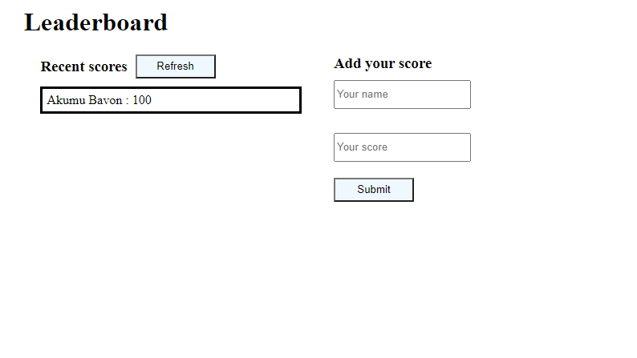
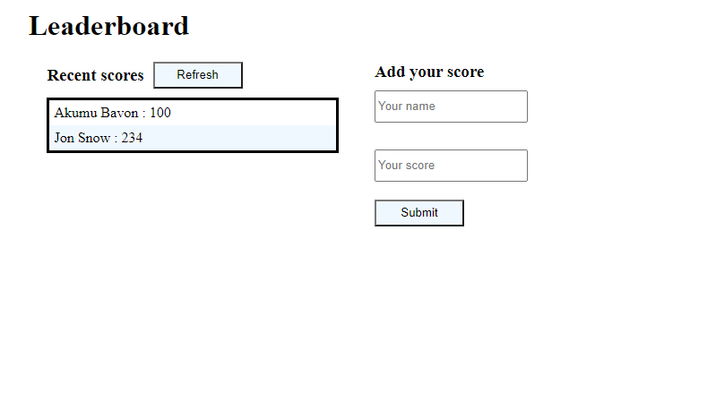

# Leaderboard
The leaderboard website displays scores submitted by different players. It also allows you to submit your score. All data is preserved thanks to the external Leaderboard API service.

Additional description about the project and its features.
## Screenshots Desktop 📷

## Screenshots Mobile 📷📲

## Built With

- HTML/CSS
- JS
- WebPack

## Live Demo

## Getting Started

**This is the starting point of my Leaderboard project, built with newly acquired skills**

To get a local copy up and running follow these simple example steps.

### Setup
- `git clone https://github.com/Bavon101/Leaderboard.git`
- `cd Leaderboard`
- `npm i`
- `npm run dev`
<!-- ### Install

### Usage

### Run tests

### Deployment -->

## Authors

👤 **Author**

- GitHub: [@Bavon101](https://github.com/Bavon101)

## 🤝 Contributing

Contributions, issues, and feature requests are welcome!

Feel free to check the [issues page](../../issues/).

## Show your support

Give a ⭐️ if you like this project! and cheers✨

## Acknowledgments

- Microverse offered guidance on how to make the project more professional

## 📝 License

This project is [MIT](./MIT.md) licensed.